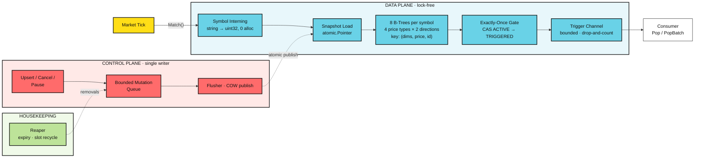

<h1 align="center">chrono-tree</h1>

<p align="center">
  An in-memory price-alert engine for markets. Register "BTCUSDT ask ≥ 65000",
  feed it ticks, and matching alerts fire exactly once — allocation-free,
  at millions of concurrent alerts.
</p>

<p align="center">
  Built for crypto-style markets: high tick rates, sub-cent precision
  (8–18 decimals), venues and book tiers as match dimensions.
</p>

<div align="center">

[](https://go.dev)
[](https://github.com/tidwall/btype)

</div>

## Overview

> chrono-tree is a pure Go engine library that holds millions live price alerts
> and evaluates them against a continuous tick stream. The hot path never
> allocates and never blocks: a tick descends two B-trees for its symbol,
> touches only entries in range, and fires winners through a single CAS.
> Alerts are terminal once triggered — one alert, one trigger.

## Features

- **Zero-Allocation Matching** — a tick touches only its symbol's trees: ~0.55–0.75 µs per tick at 1M alerts on 4–12 threads (~4.2 µs single-threaded); 0 allocs/op asserted in tests. Per-tick cost is O(qualifying entries).
- **Exact Integer Prices** — no floats anywhere. Prices are `int64` base units (`"12.34"` at 2 decimals is `1234`); one conversion boundary (`price`) accepts only values representable exactly, which sub-cent tokens with 8–18 decimals require.
- **Partitioned B-Tree Index** — 8 trees per symbol (4 price types × 2 directions), keyed by `(dims, price, id)`. Every entry a scan visits qualifies by construction — there are no per-entry filters.
- **Copy-on-Write Snapshots** — mutations are applied to tree copies and published with one atomic store (RCU style). Ticks never block writers; writers never block ticks.
- **Exactly-Once Firing** — the ACTIVE → TRIGGERED transition is a single CAS on a per-alert slot, so concurrent ticks and stale snapshots cannot double-fire.
- **Up to 8 Match Dimensions** — caller-owned dimension values (e.g. venue, book tier) fold into the tree key; a fire requires exact equality across all of them.
- **Bounded Trigger Queue** — a buffered channel delivers triggers with non-blocking, drop-and-count sends; a slow consumer means counted drops, never backpressure into the matching path.
- **Background Reaper** — sweeps expiries, recycles alert slots, and runs an integrity pass that also reclaims removals shed by a full mutation queue (counted in `Stats().MutationDrops`); shutdown is goleak-verified.

## Architecture



One package, no network, no I/O — everything follows one decision:
**readers never mutate shared state.**

- **Index** — each alert is a ~64-byte, pointer-free record stored *by value*
  in a [`tidwall/btype`](https://github.com/tidwall/btype) table keyed by
  `(dims, price, id)`; 8 tables per symbol (4 price types × 2 directions), so
  every entry a scan visits qualifies by construction.
- **Publication** — upserts and cancels batch through a bounded queue to a
  single flusher, which applies them to tree copies and publishes with one
  atomic store (RCU). Firing cannot mutate a snapshot: the CAS flips a status
  slot, the tree removal is deferred to the flusher.
- **Delivery** — winners land on a bounded buffered channel (`Pop` / `PopBatch` / `C`). A
  slow consumer means counted drops, never backpressure into `Match`.

## Benchmarks

```
go test ./engine -run '^$' -bench='Sweep(100k|1M)(Dims)?$' -benchtime=1x -benchmem -count=3
```

AMD Ryzen 5 5600H (6 cores / 12 threads; g12 is SMT), Linux/amd64, go1.27.0.

| benchmark | threads | ns/op | B/op | allocs/op | |
|---|---:|---:|---:|---:|---|
| Sweep100k | 1 | 615.6 | 27 | 0 | 100k alerts across 500 symbols, no match dims |
| Sweep100k | 4 | 171.1 | 34 | 0 | |
| Sweep100k | 12 | 106.2 | 48 | 0 | |
| Sweep1M | 1 | 4227 | 178 | 0 | 1M alerts across the same 500 symbols |
| Sweep1M | 4 | 753.6 | 217 | 0 | |
| Sweep1M | 12 | 553.5 | 227 | 0 | |
| Sweep100kDims | 1 | 352.8 | 23 | 0 | Sweep100k with 2 match dims |
| Sweep100kDims | 4 | 110.9 | 46 | 0 | |
| Sweep100kDims | 12 | 66.0 | 34 | 0 | |
| Sweep1MDims | 1 | 1109.5 | 164 | 0 | Sweep1M with 2 match dims |
| Sweep1MDims | 4 | 312.1 | 267 | 0 | |
| Sweep1MDims | 12 | 197.8 | 153 | 0 | |

> **0 allocs/op, nonzero B/op:** `Match` itself never allocates — pinned by
> `testing.AllocsPerRun` in `TestMatchZeroAllocs`/`TestMatchDimsZeroAllocs`.
> The `B/op` is background control-plane churn (flusher COW node clones,
> reaper bookkeeping) that scales with the fire rate, not the tick rate;
> `allocs/op` reads 0 only because that churn amortizes to well under one
> allocation per tick.

Sustained-load sweep: 500 symbols, 12 virtual seconds at 200 ticks per
symbol-second (1.2M ticks per scenario), price-band frontiers advancing so
~5% of the population fires per virtual second (~60% depleted at the end,
both trees still live). A consumer drains triggers out of band.

---

<p align="center">
  <a href="mailto:emirakts0@gmail.com">emirakts0@gmail.com</a>
</p>
