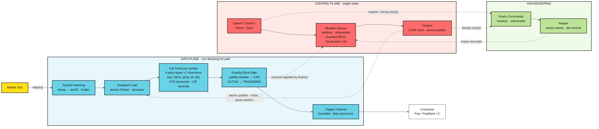

<h1 align="center">chrono-tree</h1>

<p align="center">
  An in-memory price-alert engine for markets. Register "BTCUSDT ask ≥ 65000",
  feed it ticks, and matching alerts fire exactly once — allocation-free,
  at millions of concurrent alerts.
</p>

<p align="center">
  Built for crypto-style markets: high tick rates, sub-cent precision
  (8–18 decimals), venues and book tiers as match dimensions.
</p>

<div align="center">

[](https://go.dev)
[](https://github.com/tidwall/btype)

</div>

## Overview

> chrono-tree is a pure Go engine library that holds millions live price alerts
> and evaluates them against a continuous tick stream. The hot path never
> allocates and never blocks: a tick descends two B-trees for its symbol,
> touches only entries in range, and fires winners through a single CAS.
> Alerts are terminal once triggered — one alert, one trigger.

## Features

- **Zero-Allocation Matching** — a tick touches only its own symbol's trees, so per-tick cost stays nearly flat into the millions of alerts; the hot path allocates nothing, pinned by tests.
- **Exact Integer Prices** — no floats: prices are `int64` base units (`"12.34"` = `1234`); conversion accepts only exactly representable values.
- **Partitioned B-Tree Index** — trees are partitioned per symbol, price type, and direction: every entry a scan visits qualifies by construction.
- **Copy-on-Write Snapshots** — mutations apply to tree copies and publish with a single atomic store; ticks never block writers, writers never block ticks.
- **Exactly-Once Firing** — the ACTIVE → TRIGGERED transition is one CAS on a per-alert slot; concurrent ticks and stale snapshots cannot double-fire.
- **Up to 8 Match Dimensions** — caller-owned values (venue, book tier) fold into the tree key; a fire requires exact equality across all of them.

## Architecture



One package, no network, no I/O — everything follows one decision:
**readers never mutate shared state.**

- **Index** — each alert is a ~64-byte, pointer-free record stored *by value*
  in a [`tidwall/btype`](https://github.com/tidwall/btype) table keyed by
  `(dims, price, id)`, with the slot handout (`idx`) as identity tie-break:
  a delayed removal of a fired handout can never delete a same-key
  replacement's record. 8 tables per symbol (4 price types × 2 directions),
  so every visited entry qualifies by construction.
- **Publication** — upserts and cancels batch through the unbounded, lossless
  mutation queue to a single flusher, which applies them to tree copies and
  publishes with one atomic store (RCU). Firing cannot mutate a snapshot: the
  CAS flips a status slot, the tree removal is deferred to the flusher.
  Upserts gate, intern, enqueue, and publish under one lock — a removal never
  overtakes the insert it targets.
- **Delivery** — winners land on a bounded channel (`Pop` / `PopBatch` / `C`);
  a slow consumer means counted drops, never backpressure into `Match`.

## Usage

```
go get github.com/emir/chrono-tree/engine
```

Working examples — full cycle, control plane, match contract, trigger
delivery, match dims — live in **[examples.md](examples.md)**.

## Benchmarks

```
go test ./engine -run '^$' -bench='SweepHold(100k|1M|5M)(Dims)?$' -benchtime=1x -benchmem -count=3
go test ./engine -run '^$' -bench='Sweep(100k|1M|5M)(Dims)?$' -benchtime=1x -benchmem -count=3
go test ./engine -run '^$' -bench='Upsert' -benchmem -count=3
```

AMD Ryzen 5 5600H (6 cores / 12 threads; g12 is SMT), Linux/amd64, go1.27.0.

> `Match` never allocates — pinned by `TestMatchZeroAllocs`/`TestMatchDimsZeroAllocs`.
> Nonzero `B/op` is flusher/reaper churn that scales with fire rate, amortized
> to under one allocation per tick.

Fires pinned at 50k across all `SweepHold*` runs; population scales 100k → 5M.

| benchmark | ns/op | B/op | allocs/op | |
|---|---:|---:|---:|---|
| SweepHold100k-g1 | 559.5 | 24 | 0 | 100k alerts, 50k fires, no match dims |
| SweepHold100k-g4 | 130.4 | 52 | 0 | |
| SweepHold100k-g12 | 103.2 | 51 | 0 | |
| SweepHold1M-g1 | 584.8 | 25 | 0 | 1M alerts, 50k fires |
| SweepHold1M-g4 | 159.4 | 62 | 0 | |
| SweepHold1M-g12 | 114.0 | 52 | 0 | |
| SweepHold5M-g1 | 736.2 | 33 | 0 | 5M alerts, 50k fires |
| SweepHold5M-g4 | 163.2 | 93 | 0 | |
| SweepHold5M-g12 | 115.3 | 62 | 0 | |
| SweepHold100kDims-g1 | 327.5 | 22 | 0 | SweepHold100k with 2 match dims |
| SweepHold100kDims-g4 | 87.7 | 36 | 0 | |
| SweepHold100kDims-g12 | 61.6 | 53 | 0 | |
| SweepHold1MDims-g1 | 434.0 | 79 | 0 | SweepHold1M with 2 match dims |
| SweepHold1MDims-g4 | 123.7 | 105 | 0 | |
| SweepHold1MDims-g12 | 67.4 | 55 | 0 | |
| SweepHold5MDims-g1 | 553.7 | 104 | 0 | SweepHold5M with 2 match dims |
| SweepHold5MDims-g4 | 149.4 | 123 | 0 | |
| SweepHold5MDims-g12 | 80.8 | 51 | 0 | |

Sustained-load sweep (`Sweep*`): the same timeframe with fires proportional to
population (50–70%).

| benchmark | ns/op | B/op | allocs/op | |
|---|---:|---:|---:|---|
| Sweep100k-g1 | 616.6 | 27 | 0 | 100k alerts across 500 symbols, no match dims |
| Sweep100k-g4 | 154.2 | 43 | 0 | |
| Sweep100k-g12 | 105.9 | 59 | 0 | |
| Sweep1M-g1 | 4125 | 177 | 0 | 1M alerts across the same 500 symbols |
| Sweep1M-g4 | 530.5 | 273 | 0 | |
| Sweep1M-g12 | 756.9 | 298 | 0 | |
| Sweep5M-g1 | 11306 | 777 | 0 | 5M alerts across the same 500 symbols |
| Sweep5M-g4 | 2945 | 1165 | 0 | |
| Sweep5M-g12 | 3801 | 1117 | 0 | |
| Sweep100kDims-g1 | 343.0 | 24 | 0 | Sweep100k with 2 match dims |
| Sweep100kDims-g4 | 98.0 | 39 | 0 | |
| Sweep100kDims-g12 | 59.4 | 38 | 0 | |
| Sweep1MDims-g1 | 1347 | 385 | 0 | Sweep1M with 2 match dims |
| Sweep1MDims-g4 | 365.4 | 365 | 0 | |
| Sweep1MDims-g12 | 230.6 | 249 | 0 | |
| Sweep5MDims-g1 | 5506 | 1590 | 0 | Sweep5M with 2 match dims |
| Sweep5MDims-g4 | 1424 | 1199 | 0 | |
| Sweep5MDims-g12 | 1119 | 761 | 0 | |

Sustained-load sweep, both families: 500 symbols, 1.2M ticks per scenario,
price-band frontiers advancing.

---

<p align="center">
  <a href="mailto:emirakts00@gmail.com">emirakts00@gmail.com</a>
</p>
