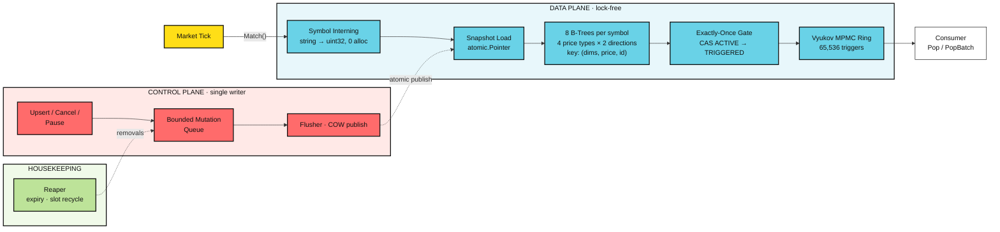

<h1 align="center">chrono-tree</h1>

  An in-memory price-alert engine for markets. Register "BTCUSDT ask ≥ 65000",
  feed it ticks, and matching alerts fire exactly once — sub-microsecond,
  allocation-free, at millions of concurrent alerts.

  Built for crypto-style markets: high tick rates, sub-cent precision
  (8–18 decimals), venues and book tiers as match dimensions.

## Overview

> chrono-tree is a pure Go engine library that holds millions live price alerts
> and evaluates them against a continuous tick stream. The hot path never
> allocates and never takes a lock: a tick descends two B-trees for its symbol,
> touches only entries in range, and fires winners through a single CAS.
> Alerts are terminal once triggered — one alert, one trigger.

## Features

- **Zero-Allocation Matching** — a tick touches only its symbol's trees: ~0.6 µs at 1M alerts, `0 B/op` asserted in tests. Per-tick cost is O(qualifying entries), independent of total alert count.
- **Exact Integer Prices** — no floats anywhere. Prices are `int64` base units (`"12.34"` at 2 decimals is `1234`); one conversion boundary (`price`) accepts only values representable exactly, which sub-cent tokens with 8–18 decimals require.
- **Partitioned B-Tree Index** — 8 trees per symbol (4 price types × 2 directions), keyed by `(dims, price, id)`. Every entry a scan visits qualifies by construction — there are no per-entry filters.
- **Copy-on-Write Snapshots** — mutations are applied to tree copies and published with one atomic store (RCU style). Ticks never block writers; writers never block ticks.
- **Exactly-Once Firing** — the ACTIVE → TRIGGERED transition is a single CAS on a per-alert slot, so concurrent ticks and stale snapshots cannot double-fire.
- **Up to 8 Match Dimensions** — caller-owned dimension values (e.g. venue, book tier) fold into the tree key; a fire requires exact equality across all of them.
- **Bounded Trigger Ring** — a Vyukov MPMC ring delivers triggers; overflow drops-and-counts instead of blocking the matching path.
- **Background Reaper** — sweeps expiries, recycles alert slots, and runs an integrity pass; shutdown is goleak-verified.

## Architecture

One package, no network, no I/O — everything follows one decision:
**readers never mutate shared state.**

- **Index** — each alert is a ~64-byte, pointer-free record stored *by value*
  in a [`tidwall/btype`](https://github.com/tidwall/btype) table keyed by
  `(dims, price, id)`; 8 tables per symbol (4 price types × 2 directions), so
  every entry a scan visits qualifies by construction.
- **Publication** — upserts and cancels batch through a bounded queue to a
  single flusher, which applies them to tree copies and publishes with one
  atomic store (RCU). Firing cannot mutate a snapshot: the CAS flips a status
  slot, the tree removal is deferred to the flusher.
- **Delivery** — winners land on a bounded MPMC ring (`Pop` / `PopBatch`). A
  slow consumer means counted drops, never backpressure into `Match`.

Correctness is checked against independent oracles: a randomized brute-force
evaluator must produce identical trigger sets, and `price` is property-tested
against `math/big` over 50,000 cases.

## Benchmarks

(AMD Ryzen 5 5600H, Linux/amd64):

| benchmark | ns/op | allocs/op | |
|---|---:|---:|---|
| MatchSparse1M | 614 | 0 | 1M alerts across 1k symbols, non-firing tick |
| MatchSparse5M | 698 | 0 | same tick at 5M alerts — per-tick cost stays ~flat |
| MatchHotSymbol1M | 1,181 | 0 | all 1M alerts on one symbol — deeper-tree seeks |
| MatchDenseSkip | 208,763 | 0 | tick price crosses 20k already-fired entries |
| MatchFire1k | 72,940 | 5 | 1k fresh fires per tick (~73 ns/fire); the allocs are the concurrent COW removal flush, not the match path |
| MatchDimsSparse1M | 915 | 0 | same as Sparse1M with 2 match dimensions |
| MatchDimsSparse5M | 1,044 | 0 | same as DimsSparse1M at 5M alerts |
| MatchDimsDenseSkip | 213,126 | 0 | same as DenseSkip with 2 match dimensions |

---

  <a href="mailto:emirakts0@gmail.com">emirakts0@gmail.com</a>

