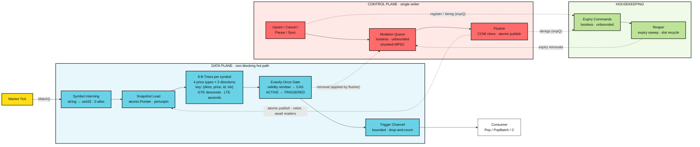

<h1 align="center">chrono-tree</h1>

<p align="center">
  An in-memory price-alert engine for markets. Register "BTCUSDT ask ≥ 65000",
  feed it ticks, and matching alerts fire exactly once — allocation-free,
  at millions of concurrent alerts.
</p>

<p align="center">
  Built for crypto-style markets: high tick rates, sub-cent precision
  (8–18 decimals), venues and book tiers as match dimensions.
</p>

<div align="center">

[](https://go.dev)
[](https://github.com/tidwall/btype)

</div>

## Overview

> chrono-tree is a pure Go engine library that holds millions live price alerts
> and evaluates them against a continuous tick stream. The hot path never
> allocates and never blocks: a tick descends two B-trees for its symbol,
> touches only entries in range, and fires winners through a single CAS.
> Alerts are terminal once triggered — one alert, one trigger.

## Features

- **Zero-Allocation Matching** — a tick touches only its own symbol's trees, so per-tick cost stays nearly flat even as live alerts grow into the millions; the hot path allocates nothing, a guarantee pinned by tests.
- **Exact Integer Prices** — no floats anywhere: prices are `int64` base units (`"12.34"` is simply `1234`), and conversion accepts only exactly representable values — the guarantee sub-cent tokens demand.
- **Partitioned B-Tree Index** — trees are partitioned per symbol, price type and direction, so every entry a scan visits qualifies by construction — no per-entry filters.
- **Copy-on-Write Snapshots** — mutations apply to tree copies and publish with a single atomic store. Ticks never block writers; writers never block ticks.
- **Exactly-Once Firing** — the ACTIVE → TRIGGERED transition is a single CAS on a per-alert slot, so concurrent ticks and stale snapshots cannot double-fire.
- **Up to 8 Match Dimensions** — caller-owned values such as venue or book tier fold into the tree key; a fire requires exact equality across all of them.

## Architecture



One package, no network, no I/O — everything follows one decision:
**readers never mutate shared state.**

- **Index** — each alert is a ~64-byte, pointer-free record stored *by value*
  in a [`tidwall/btype`](https://github.com/tidwall/btype) table keyed by
  `(dims, price, id)`, with the slot handout (`idx`) as an identity
  tie-break: a delayed removal of a fired handout can never delete the
  record of a same-key replacement upsert; 8 tables per symbol
  (4 price types × 2 directions), so every entry a scan visits qualifies by
  construction.
- **Publication** — upserts and cancels batch through the unbounded, lossless
  mutation queue to a single flusher, which applies them to tree copies and
  publishes with one atomic store (RCU). Firing cannot mutate a snapshot: the
  CAS flips a status slot, the tree removal is deferred to the flusher.
- **Delivery** — winners land on a bounded buffered channel (`Pop` / `PopBatch` / `C`). A
  slow consumer means counted drops, never backpressure into `Match`.

## Usage

```
go get github.com/emir/chrono-tree/engine
```

Working examples — a full cycle (register, feed, consume, shut down), the
control plane (cancel, pause/resume, sync), the match contract, trigger
delivery, and optional match dimensions — live in **[examples.md](examples.md)**.

## Benchmarks

```
go test ./engine -run '^$' -bench='SweepHold(100k|1M|5M)(Dims)?$' -benchtime=1x -benchmem -count=3
go test ./engine -run '^$' -bench='Sweep(100k|1M|5M)(Dims)?$' -benchtime=1x -benchmem -count=3
```

AMD Ryzen 5 5600H (6 cores / 12 threads; g12 is SMT), Linux/amd64, go1.27.0.

> **0 allocs/op, nonzero B/op:** `Match` itself never allocates — pinned by
> `testing.AllocsPerRun` in `TestMatchZeroAllocs`/`TestMatchDimsZeroAllocs`.
> The `B/op` is background control-plane churn (flusher COW node clones,
> reaper bookkeeping) that scales with the fire rate, not the tick rate;
> `allocs/op` reads 0 only because that churn amortizes to well under one
> allocation per tick.

Fires pinned at 50k across all six (`SweepHold*`): population scales from 100k
to 5M alerts while total fires stay constant.

| benchmark | threads | ns/op | B/op | allocs/op | |
|---|---:|---:|---:|---:|---|
| SweepHold100k | 1 | 555.5 | 24 | 0 | 100k alerts, 50k fires, no match dims |
| SweepHold100k | 4 | 173.9 | 36 | 0 | |
| SweepHold100k | 12 | 103.8 | 45 | 0 | |
| SweepHold1M | 1 | 587.3 | 25 | 0 | 1M alerts, 50k fires |
| SweepHold1M | 4 | 185.2 | 48 | 0 | |
| SweepHold1M | 12 | 115.2 | 45 | 0 | |
| SweepHold5M | 1 | 648.2 | 33 | 0 | 5M alerts, 50k fires |
| SweepHold5M | 4 | 194.8 | 100 | 0 | |
| SweepHold5M | 12 | 147.2 | 59 | 0 | |
| SweepHold100kDims | 1 | 362.0 | 21 | 0 | SweepHold100k with 2 match dims |
| SweepHold100kDims | 4 | 130.1 | 25 | 0 | |
| SweepHold100kDims | 12 | 88.0 | 66 | 0 | |
| SweepHold1MDims | 1 | 483.6 | 78 | 0 | SweepHold1M with 2 match dims |
| SweepHold1MDims | 4 | 157.3 | 102 | 0 | |
| SweepHold1MDims | 12 | 98.9 | 88 | 0 | |
| SweepHold5MDims | 1 | 553.6 | 106 | 0 | SweepHold5M with 2 match dims |
| SweepHold5MDims | 4 | 184.4 | 107 | 0 | |
| SweepHold5MDims | 12 | 117.6 | 64 | 0 | |

Sustained-load sweep (`Sweep*`): the same timeframe with fires proportional
to population — 50–70% of every scenario fires — so scan length and fire
rate grow with alert density.

| benchmark | threads | ns/op | B/op | allocs/op | |
|---|---:|---:|---:|---:|---|
| Sweep100k | 1 | 615.6 | 27 | 0 | 100k alerts across 500 symbols, no match dims |
| Sweep100k | 4 | 171.1 | 34 | 0 | |
| Sweep100k | 12 | 106.2 | 48 | 0 | |
| Sweep1M | 1 | 4227 | 178 | 0 | 1M alerts across the same 500 symbols |
| Sweep1M | 4 | 753.6 | 217 | 0 | |
| Sweep1M | 12 | 553.5 | 227 | 0 | |
| Sweep5M | 1 | 13035 | 683 | 0 | 5M alerts across the same 500 symbols |
| Sweep5M | 4 | 3351.5 | 726 | 0 | |
| Sweep5M | 12 | 2632.5 | 557 | 0 | |
| Sweep100kDims | 1 | 352.8 | 23 | 0 | Sweep100k with 2 match dims |
| Sweep100kDims | 4 | 110.9 | 46 | 0 | |
| Sweep100kDims | 12 | 66.0 | 34 | 0 | |
| Sweep1MDims | 1 | 1109.5 | 164 | 0 | Sweep1M with 2 match dims |
| Sweep1MDims | 4 | 312.1 | 267 | 0 | |
| Sweep1MDims | 12 | 197.8 | 153 | 0 | |
| Sweep5MDims | 1 | 3993.5 | 565 | 0 | Sweep5M with 2 match dims |
| Sweep5MDims | 4 | 1218 | 558 | 0 | |
| Sweep5MDims | 12 | 805.5 | 312 | 0 | |

Sustained-load sweep, both families: 500 symbols, 12 virtual seconds at 200
ticks per symbol-second (1.2M ticks per scenario), price-band frontiers
advancing. A consumer drains triggers out of band.

---

<p align="center">
  <a href="mailto:emirakts00@gmail.com">emirakts00@gmail.com</a>
</p>
